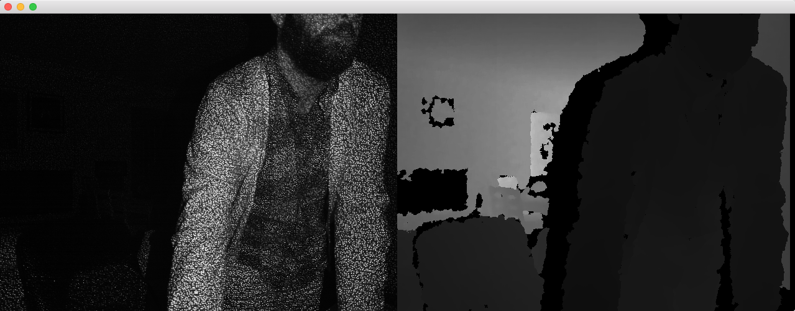

Setup
========
Working Setup;
- OS : High Sierra 10.13.6
- oF : v.0.11
- GL version : (2,1)

Fixed the addon for ASUS Xtion Sensor to run with oF v.0.11.0. Cannot make run the example-assimp-model & example-user-tracker projects.

**Cannot make it run with Kinect v.01!
**

OSX
--------

Add to Run Script

	cp -R ../../../addons/ofxNI2/libs/OpenNI2/lib/osx/ "$TARGET_BUILD_DIR/$PRODUCT_NAME.app/Contents/MacOS/";
	cp -R ../../../addons/ofxNI2/libs/NiTE2/lib/osx/ "$TARGET_BUILD_DIR/$PRODUCT_NAME.app/Contents/MacOS/";

Uncomment

    //#define HAVE_NITE2

in `ofxNI2.h` to use NiTE2.

Visual Studio
--------

Download OpenNI2 from http://structure.io/openni and install. Choose x86 (32bit) or x64 (64bit) depending on your project settings.

Copy `OpenNI2\`, `OpenNI2.ini` and `OpenNI2.dll` from `C:\Program Files (x86)\OpenNI2\Redist` (x86) or `C:\Program Files\OpenNI2\Redist` (x64) to `projectFolder\bin\`.

To use Microsoft Kinect through OpenNI2, install Microsoft SDK 1.x as well.
